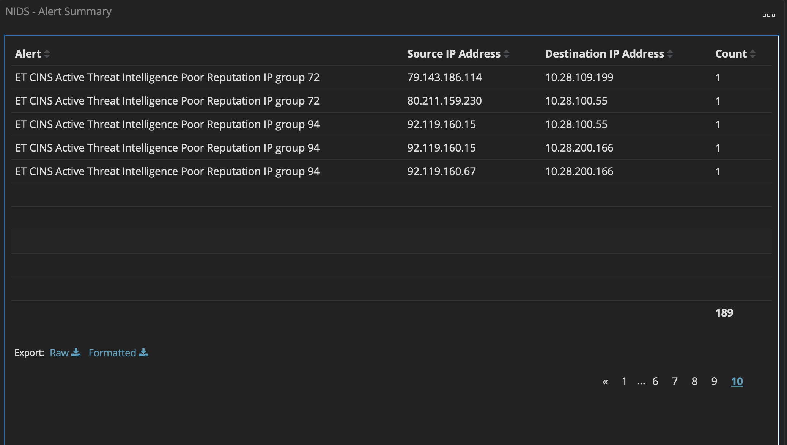
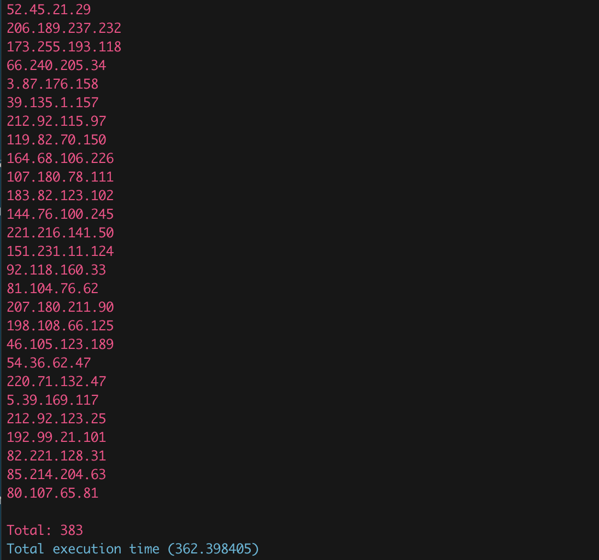

# 简介
----

ThreatHound是一款威胁情报查询工具，用于查询潜在的恶意IP或者域名。它结合MISP开源威胁情报共享平台作为其后端情报库，当前整合了开源社区69个开源威胁情报数据feed。

欢迎踊跃提交威胁情报feed,一起构建开源威胁情报库

# Usage
----

## 安装

1.安装依赖
```
pip3 install OTXv2
pip3 install color
```

2.修改程序源码中对应的MISP Server、AlienVault API KEY即可


## 使用
> ⚠️注意：缓存数据需配合MISP Server一起使用，如果未搭建可使用仓库中已离线数据，只是无法及时更新feed数据

### 缓存feed数据

1.缓存所有feed数据

```
python3 ThreatHound.py --fetch all
```

2.只缓存单个feed数据

```
python3 ThreatHound.py --fetch <feedID>
```

3.缓存id为n-m的feed数据

```
python3 ThreatHound.py --fetch n m
```

### 离线查询模式
1.对IP列表进行查询
```
python3 ThreatHound.py --local --type ip <IP列表>
```
2.对域名列表进行查询
```
python3 ThreatHound.py --local --type domain <域名列表>
```
3.对单个IP进行查询
```
python3 ThreatHound.py --local --ip <IP>
```
4.对单个域名进行查询
```
python3 ThreatHound.py --local --domain <DOMAIN>
```

### 在线查询模式
1.对IP列表进行查询
```
python3 ThreatHound.py --online --type ip <IP列表>
```
2.对域名列表进行查询
```
python3 ThreatHound.py --online --type domain <域名列表>
```
3.对单个IP进行查询
```
python3 ThreatHound.py --online --ip <IP>
```
4.对单个域名进行查询
```
python3 ThreatHound.py --online --domain <DOMAIN>
```

### 示例

Suricata NIDS对低信誉IP的检出情况



脚本对低可信IP的检出情况，低信誉IP检出数从95增加至383



# 参考

----
- [MISP](https://www.misp-project.org/)
- [AlienVault OTX](https://otx.alienvault.com/api/)
- [Awesome-Threat-Intelligence](https://github.com/hslatman/awesome-threat-intelligence)
